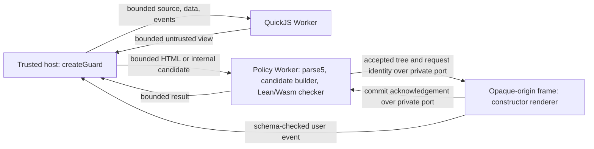

# Secure runtime refactor plan

Status: proposed implementation plan. No runtime fixes or proof changes have
been implemented by this document. Checkboxes record implementation completion,
not agreement with the design.

## Objective and decisions

Make the ordinary integration one API that owns execution, preprocessing,
validation, rendering, events, and cleanup. Every rendered generated document
must pass the Lean/Wasm checker. Reduce duplicated enforcement while fixing the
resource-boundary defects found in the security review.

The target decisions are:

- Lean/Wasm is the production acceptance authority. Missing Wasm, startup
  failure, rejection, malformed output, and timeout never fall back to JS
  acceptance.
- Generated JavaScript runs only in QuickJS in a dedicated Worker. Remove the
  mandatory AST denylist; QuickJS compilation and runtime interface checks
  provide errors. Optional linting is a separate development feature.
- A separate policy Worker owns bounded parse5 preprocessing, candidate
  construction, and Lean acceptance. parse5 is the selected production frontend:
  parsing and validation operate on strings and plain data without a browser DOM.
  Generated JS never runs in the policy Worker.
- The frame renders only decisions delivered directly by that policy Worker
  over a private MessagePort. A parent-supplied tree or `validated: true` flag
  cannot bypass acceptance.
- Policies configure a closed, reviewed capability set. Profile authors can
  restrict it; enabling a new browser capability requires kernel/security
  review, even when the change is expressed as data.
- Keep the current acceptance/replay checks during migration. Replace them
  only after a smaller candidate checker has explicit equivalent obligations
  and proofs. Do not simply delete the second normalization.

Proofs are checked during development and CI. Production executes the checker
whose properties were proved; it does not rerun proof tactics for each document.
Compiling that checker into the shipped Wasm closes the current JS-reference
gap, but is not a proof of the compiler, FFI, JSON conversion, renderer, browser,
or QuickJS isolation.

## Current findings and required outcomes

These are local review reproductions and source findings, not CVE claims.

| ID | Evidence and affected code | Required outcome |
|---|---|---|
| R1 | Guest `Array.prototype.toJSON` replaces the final packet after guest-side size checks in [core.js](src/runtime/core.js). Default limits of 400,000 view characters and 1,000,000 state characters were exceeded. | Enforce packet and field bounds outside the guest before forwarding, parsing, or committing state. |
| R2 | Error dumping runs after interrupt removal in [core.js](src/runtime/core.js). A thrown object's serialization hook ran about 254 ms under a 20 ms evaluation budget. | Keep guest execution interruptible during extraction/error handling; retain an independent Worker watchdog. |
| R3 | 5,000 nested divs, 55,001 characters, overflow [the parse5 adapter](src/adapters/parse5.js) before policy depth rejection. A long property chain overflows [the AST walk](src/gate.js). | Bound preprocessing before output checking; use iterative/budgeted traversal; remove the mandatory AST walk from the execution path. |
| R4 | [CDN entry points](src/cdn.js) and [the frame](src/frame.js) use JS; [build CI](.github/workflows/build.yml) runs JS verification without building Lean proofs. | Make Lean acceptance unavoidable in the integrated production path and verify current source-to-artifact builds in CI. |
| R5 | [Schema validation](scripts/gen-policy.mjs) accepts an anchor with `href: ["text"]` and SVG `fill: ["text"]`. | Reject configurations that exceed the capability set or assign an incompatible value grammar to an attribute. |

R1/R2 concern resource/protocol enforcement; they did not demonstrate a sandbox
escape. R5 is a configuration-authoring hazard, not an exploit against the
current default policy. Existing tests can pass while these cases remain.

Review baseline: 64 JS unit tests passed, one Lean differential test was
intentionally skipped, 119 BDD scenarios passed, and JS behavioral checks
passed. The review did not freshly verify Lean/Wasm or browser behavior.

## Integrated API

Proposed public interface; these names do not exist yet:

```js
import { createGuard } from "generative-web-guard";

const guard = await createGuard({
  container: document.querySelector("#generated-content"),
  onStatus(status) {
    // Trusted application UI can display bounded status/diagnostic data.
  },
});

const result = await guard.render({
  html: generatedHtml,
  program: generatedJavaScript, // optional: omit for a static document
  data: hostDataset,            // optional JSON data readable by the program
});

if (result.status === "rejected") {
  console.log(result.reason);   // bounded code/detail, not guest error objects
}

await guard.render({ html: replacementHtml }); // replaces the document/program
await guard.clear();                          // clears DOM and stops interaction
guard.dispose();                             // idempotent; releases all resources
```

Contract:

- `createGuard` resolves only after the frame, channel, and Lean checker are
  ready. It rejects on unsupported platform/CSP, startup failure, or timeout.
  QuickJS can start lazily when a program is supplied.
- With no program, `render` validates and commits `html`. With a program, it
  initializes QuickJS and validates the first returned view before committing.
  Supplied `html` does not silently become a successful fallback if program
  initialization fails. Any future preview feature must report preview status
  explicitly and validate that preview through the same authority.
- `render` resolves `rendered` only after a frame acknowledgement for the exact
  request/generation. It can return `rejected` or `superseded`; queuing a message
  is not a successful render. Expected hostile-input failures use result codes;
  API misuse and unavailable infrastructure produce documented exceptions.
- An explicit replacement stops old interaction and cancels old queued work.
  The previous accepted display may remain until the replacement commits.
  Failure leaves it noninteractive with a failure status. A rendering exception
  clears partial DOM; never report an atomic commit that did not happen.
- Frame events are schema-checked and routed automatically to the active
  QuickJS program. State advances sequentially; each view follows the full
  acceptance path. An event/update failure stops that session. No unbounded
  promise queue or implicit retry loop is allowed.
- `clear` and `dispose` invalidate generations, settle pending operations,
  terminate Workers as appropriate, close ports, and release Blob URLs. Late
  messages cannot render or restart a disposed session.
- The API does not expose a raw generated view as its normal result, an unsafe
  DOM mount, caller-selected checker/renderer callbacks, or a skip-validation
  option. Status callbacks are not a bridge from guest actions to host powers.
- Profiles are selected at instance creation from built, verified profiles;
  changing a profile recreates the session. First ship one default profile.
  Avoid per-instance mutable global class allowlists.

The trusted host application, its callbacks, and its own DOM remain outside the
attacker model. Host-supplied data must already be suitable for the guest to read
and display. Freezing data does not make it confidential or establish semantic
trustworthiness of generated content.

## Target data flow and enforcement ownership



The host creates both Workers and transfers opposite ends of a MessageChannel
to the policy Worker and the frame. The frame accepts a one-time bootstrap only
from its parent, then accepts render commands only through the installed port.
The policy Worker sends the exact accepted tree; the host does not substitute
another tree between acceptance and rendering. All messages carry a protocol
version, instance/session identity, generation, and request ID. Reject stale,
duplicate, unexpected, or mismatched replies and settle every request once.

This placement keeps Wasm compilation and parser work off the host/frame event
loops, and avoids requiring the frame to construct Workers under its current
Trusted Types policy. It adds one policy Worker per active instance, not separate
parser, normalizer, and proof Workers. Start with this simple ownership model;
pooling and shared Workers are out of scope.

The port provides delivery provenance, not a mathematical certificate. Trusted
Worker glue and frame glue remain in the trusted computing base. Candidate
construction is untrusted for logical correctness; arbitrary compromise of the
Worker's JavaScript glue is not covered by the Lean theorem.

At the rendering boundary retain `sandbox="allow-scripts"` without
`allow-same-origin`, constructor-only rendering, fixed stylesheet/script hashes,
network/navigation restrictions, source checks for events, and Trusted Types.
Do not expose privileged host operations through `data-action`.

Run an early browser feasibility check for the channel bootstrap, CDN-created
Workers, Wasm initialization, and CSP inheritance. The host/Worker CSP needs
the appropriate Worker source and Wasm compilation permissions; do not assume
the current demo CSP is sufficient. Determine exact requirements experimentally
against the [CSP specification](https://www.w3.org/TR/CSP3/#directive-script-src) and
[Worker specification](https://html.spec.whatwg.org/multipage/workers.html#dom-worker).
Keep the frame's policy tight; do not solve compatibility by enabling arbitrary
JavaScript evaluation or restoring same-origin access. Unsupported configurations
fail with an actionable startup error.

## HTML preprocessing: string to tree without a DOM

Use parse5 as the single production HTML frontend. The target path is:

```text
HTML string -> parse5 -> bounded raw tree -> candidate builder
            -> Lean/Wasm acceptance -> accepted tree -> frame DOM constructors
```

parse5 and the adapter produce plain JavaScript data. Parsing, candidate
construction, and validation need no browser DOM and run in the terminable
policy Worker. The frame needs a DOM only to render accepted output. Keep the
candidate builder small: project permitted structure and canonicalize values;
Lean remains the acceptance authority.

HTML/SVG tree validation remains mandatory. It recognizes the restricted output
language; it does not statically analyze arbitrary JavaScript embedded in HTML.
Script nodes never become executable DOM. Removing the JavaScript AST denylist
does not remove markup policy checks or preprocessing resource limits.

The CDN already uses parse5, while the demos currently use DOMParser. Migrate
the demos to the same parse5 path through the integrated API. Test malformed
markup, namespaces, benign preservation, and resource limits against that exact
production frontend. DOMPurify evaluation, DOM emulation, and a separate DOM
preprocessing environment are outside this refactor's scope.

## JavaScript: confinement instead of a mandatory AST denylist

QuickJS should compile the program and check the existing
`initialState`/`update`/`view` interface. The current identifier denylist is not a
security boundary: computed access, constructors, aliases, and generated source
can express the same operations. Removing it is safe only when confinement is
tested independently of it.

Keep these mandatory controls:

- No DOM, network, filesystem, credentials, host objects, host callbacks, or
  module loader exposed to the guest. Built-in dynamic evaluation, if available
  inside QuickJS, remains inside that same capability boundary.
- Source/data/packet/field bounds; memory/stack limits; evaluation deadlines
  covering all guest execution; an external Worker watchdog; bounded event
  queues and diagnostic output.
- Synchronous interface results. Unsupported promise/async results fail the
  interface checks; do not drain an unbounded job queue or add asynchronous host
  capabilities to make such programs work.
- Every returned view passes independent protocol checks and Lean acceptance.
  Serialization hooks and prototype mutation remain hostile guest behavior.

Optional syntax/style linting can help regeneration, but should live in a
separate opt-in development entry point and execute with its own traversal and
time budgets. Do not keep Acorn in the default runtime solely for security.
If the low-level `gateProgram` export is retained for compatibility, harden its
walk and label its result as diagnostic eligibility, never as authorization.

## Policy and proof foundation

Keep [rules/policy.json](rules/policy.json) as profile data and
[rules/catalog.json](rules/catalog.json) as explanations/evidence. Add a separate
reviewed capability specification, proposed as `rules/capabilities.json`, with
closed element/attribute identities, context-appropriate validator families,
fixed requirements, namespace constraints, and absolute resource ceilings.

Examples: `title` may use plain text; SVG `fill`/`stroke` must use restricted
solid-paint validation. Profiles cannot introduce arbitrary attribute names,
change paint into generic text, turn resource URLs into text, remove mandatory
control attributes, or raise limits above the kernel's ceilings. Restrict enums
by set inclusion and numeric ranges by interval inclusion. Require exact
identity for custom grammars initially; do not build a general implication
solver or permit arbitrary regular expressions/callbacks.

Generate JS/Lean inventories from this reviewed source, but do not claim the
generator or an arbitrary edited inventory is proved safe. Lean must check
profile well-formedness against that inventory; independent baseline theorems
must express exclusions and value contracts without merely repeating the
mutable profile. Expanding the inventory is a kernel change. Version its
meaning and review it together with browser behavior, tests, and proof scope.

Proposed obligations, expressed schematically rather than as existing theorems:

```text
profileValid(p) = true
  -> profile p stays within the reviewed capability set and hard limits

profileValid(p) = true AND acceptCandidate(p, t) = true
  -> conforms(p, t) AND coreInvariants(t)

profileRestricts(p2, p1) AND acceptedBy(p2, t)
  -> permittedBy(p1, t)
```

The last property concerns permitted output trees. Do not infer that tightening
a sanitizer must monotonically reduce successful raw-input requests: it may
remove more content while continuing to accept a smaller output.

Build the candidate checker from [Accept.lean](lean/Guard/Policy/Accept.lean),
but add everything currently obtained from replay before retiring replay:
strict root/node decoding, exact namespace/name representation, unique sorted
attributes, canonical validator results, required attributes, recursive context
rules, and complete size/depth accounting. Document and prove any remaining
fixed-point property separately. The current predicate alone is not a drop-in
replacement for `checkTree`.

Strengthen primitive contracts where useful: grammar membership, canonical
form, actual numeric ranges/counts, and rejection of resource-reference syntax
in paint values. Character-set theorems alone do not establish those properties.
Do not assert browser noninterference or bounded CPU time from structural or
termination proofs. Browser effects, layout cost, and runtime budgets still need
their own evidence and assumptions.

## Implementation sequence

Each phase is a coherent change with an exit gate. Fixes can ship before the
complete architecture migration; they must not be presented as completing it.

### Phase 1 — Fix the guest boundary and capture regressions

- [x] Add R1/R2 regressions with explicit limits and benign controls. Cover
  prototype `toJSON`, getters/proxies, thrown objects, oversized initial state,
  malformed packets, missing/extra fields, and failure during extraction.
- [x] Enforce output lengths and exact packet shape outside QuickJS. Bound the
  packed representation before host `JSON.parse`; account for JSON escaping
  overhead when deriving a packet limit from state/view limits.
- [x] Bound extraction itself where the FFI allows it: inspect guest value
  type/length before copying, avoid generic object dumping for successful
  results, and cap the maximum transport allocation. A check after an unbounded
  copy is too late. Record any unavoidable copy bound explicitly.
- [x] Keep the interrupt deadline installed until extraction/error processing
  has finished. Avoid guest-controlled string coercion to produce errors; use
  bounded diagnostics or a generic error if safe extraction fails. Dispose
  handles on every path; retain the independent Worker watchdog.
- [x] Validate results again at the controller's receive boundary before
  committing state or forwarding views. Define one protocol/limits module
  instead of independent magic constants, with enforcement on both sides.
- [x] Repair controller lifecycle holes: malformed replies settle the active
  job, pre-load `step` fails, disposal settles all promises, and timeouts cover
  initialization, evaluation, conversion, and message round trips.

Primary files: `src/runtime/{core,worker,controller}.js`, `test/runtime.test.js`,
`features/runtime.feature`, and a proposed `src/runtime/protocol.js`.

Exit: JS unit/BDD checks and real-Worker browser tests demonstrate bounded
failure with the AST gate bypassed. Oversized or malformed guest output never
reaches markup parsing. This phase does not claim Lean production enforcement.

### Phase 2 — Bound preprocessing and remove the mandatory AST gate

- [x] Add R3 regressions at the public HTML/program entry points, including
  deeply nested allowed, unwrapped, and dropped elements; wide trees; excessive
  attributes; long names; comments; text; and long property chains.
- [x] Define input limits before parsing/cloning: source HTML, raw node count,
  raw depth, attribute count/bytes, total candidate bytes, and diagnostics.
  Count input work even when the resulting output would discard it. Name units
  explicitly: UTF-16 characters versus encoded UTF-8 bytes.
- [x] Replace recursive adapters with bounded iterative traversal and a defined
  structured rejection. Catch parser failures at the Worker boundary. Enforce
  source limits before parse5; use external Worker termination for parser time
  limits since adapter checks cannot interrupt the parser itself.
- [x] Move parse5 and candidate construction into the policy Worker scaffold.
  Adopt this frontend for demos and the integrated API; retain DOMParser only
  for explicitly separate compatibility tests until its removal is complete.
- [x] Remove `gateProgram` from mandatory execution and the default dependency
  path. QuickJS compiles source under limits and checks the synchronous interface.
  Bound any retained optional linter; update diagnostics and expected examples.

Exit: host UI remains responsive under hostile preprocessing; timeouts terminate
the Worker and settle requests. Tests show computed access and indirect dynamic
evaluation still cannot acquire host capabilities. JS/browser checks pass;
full verification also runs if traversal or checker semantics change.

### Phase 3 — Enforce capability restrictions and fresh proof checks

- [x] Introduce the closed capability specification and R5 negative tests for
  unsafe elements, URL attributes, paint-as-text, weakened forced attributes,
  and raised hard limits. Include valid restriction/benign preservation cases.
- [x] Implement Lean profile validation and the profile/core invariants above.
  Generate a certificate/theorem for each shipped profile at build time; keep
  arbitrary runtime profile loading out of the first release.
- [x] Add CI that prepares pinned toolchains and runs full `npm test` from the
  current checkout. Audit theorem kinds and transitive axioms. Fail on missing
  toolchains or stale generated files. Cache toolchains, not unchecked results.
- [x] Verify all changes affecting Lean, policy, generators, runtime integration,
  build logic, or dependencies. Initially prefer an unconditional proof job
  over fragile path filters. Documentation-only optimization can follow.

Exit: invalid configurations fail independently of whether a matching exploit
appears in the corpus. Current proofs compile in CI. Required branch checks are
a repository-settings task to track separately; adding workflow YAML alone
does not enable branch protection.

### Phase 4 — Put Lean in production before shrinking the checker

- [x] Complete the policy Worker/frame private-port feasibility check with
  Chromium, Firefox, and WebKit where supported. Decide and document the tested
  browser/CSP support matrix before making compatibility claims.
- [x] Initially run the existing Lean `checkTree` including its postcondition
  and replay. Render only its returned accepted tree; never render a JS
  candidate based on an unrelated Lean success flag. Keep extra legacy checks
  until the end-to-end authority path is proven by integration tests.
- [x] Define a versioned, bounded single-document Wasm ABI instead of exposing
  the permissive batch test interface as the public authority. Bind profile,
  classes, stylesheet, and checker version to the built instance, not guest
  input. Reject malformed/unknown protocol data explicitly.
- [x] Harden Lean JSON decoding, C allocation/free paths, UTF-8 conversion,
  candidate serialization, and response handling. The current `rawFromJson`
  drops malformed fields and uses partial recursion; do not describe that as a
  strict candidate decoder. Test duplicate fields/attributes, NULs, lone
  surrogates, supplementary characters, and exact tree round trips.
- [x] Set explicit Wasm memory/stack ceilings and Worker timeouts. Audit the
  current 64 MB initial memory, 16 MB stack, and growth configuration before
  adopting them as production defaults. Lean termination does not bound cost.
- [x] Ship the actual rebuilt Wasm and glue in the distribution. Record hashes
  of checker, policy, and frame assets in a deterministic manifest. These bind
  build contents and detect mismatch; hashes alone do not prove provenance.
- [x] Add negative integration controls: make Lean reject a benign candidate,
  remove/corrupt the module, stall it, spoof/replay a response, or force the JS
  candidate builder to emit a forbidden tree. All must prevent rendering or
  produce bounded failure. Keep these injections test-only.

Exit: every frame commit in the new path depends on a matching Lean acceptance;
the deployed bytes are the bytes rebuilt and tested in CI. No JS-only fallback.
Preserve separate browser evidence for renderer, messaging, CSP, and containment.

### Phase 5 — Deliver the integrated API and migrate consumers

- [x] Implement `createGuard` and the lifecycle contract above in a proposed
  `src/guard.js`. Keep event routing, state sequencing, and view validation
  inside it. Remove the need for application-written glue between these steps.
- [ ] Update both demos and README examples to use it. Exercise the package's
  built exports, not source-only replacements, in browser tests.
- [x] Replace direct parent `render` messages with the policy-Worker channel.
  Any temporary low-level `frame.render(tree)` wrapper sends candidates through
  Lean; it cannot remain a second JS-only route into the frame.
- [x] Document legacy `guardHtml`, `createGuardRuntime`, and `gateProgram`
  precisely. Keep compatibility only through explicit low-level/legacy exports;
  raw strings/trees returned there are not a completed secure integration.
  Do not silently change a synchronous function into an asynchronous one.
- [x] Make the default entry point include the mandatory policy Worker and Lean
  authority. Preserve existing bundle paths as documented wrappers where
  practical; announce breaking removals. QuickJS can remain lazy/optional for
  static use, but Lean acceptance cannot be optional.
  - Resolved (maintainer decision): keep the split. `createGuard` and the
    embedded Lean authority ship from the `./full` entry; the default entry
    stays the documented low-level bundle. There is no `createGuard` without
    the embedded authority, so nothing renders through a JS-only default.
- [x] Test replacement, rejection, supersession, queue saturation, startup
  failure, clear, dispose, late events, missing acknowledgements, repeated
  creation/destruction, and cross-origin CDN imports with restrictive host CSP.

Exit: a consumer can safely render an interactive document using only the
example API. All lifecycle promises settle, resources are released, and every
view uses the same acceptance path. Source APIs cannot accidentally bypass it.

### Phase 6 — Reduce duplicated policy enforcement

A self-contained handoff for a focused session: [docs/phase-6-plan.md](docs/phase-6-plan.md).

- [ ] Split JS candidate construction/diagnostics from acceptance. It may
  propose content but cannot declare a document safe for production rendering.
- [ ] Implement the smaller Lean `acceptCandidate` checker with strict decoding
  and canonicality obligations described above. Prove its concrete invariants
  and test preserved behavior before replacing production `checkTree`.
- [ ] Remove repeated host/frame normalization and redundant JS acceptance
  copies from the default runtime only after Phase 4/5 bypass tests still pass.
  Keep renderer assertions where they check its own construction contract.
- [ ] Retain the full Lean normalizer and JS comparison as reference/test tools
  initially. Stop requiring identical diagnostic change counts where the new
  contracts intentionally differ; continue independent safety, exact benign
  output, and agreement tests for shared semantic behavior.
- [ ] Bundle only the candidate checker and necessary dependencies into the
  production Wasm entry. Measure cold start, resident/peak memory, typical and
  maximum-size render latency, message copies, and compressed distribution
  size. Record before/after numbers on the supported browser matrix.

Exit: one authoritative candidate checker per render, one production parsing
frontend, a small public API, and an explicit account of what duplication was
removed. Proofs/specifications are strengthened or deliberately replaced with
documented obligations, never weakened just to make verification pass.

## Verification and release gates

Use checks proportional to each phase and record actual results/skips:

| Changed boundary | Required evidence |
|---|---|
| This plan only | Relative-link existence and whitespace checks; no rebuild. |
| Runtime/transport | `npm run test:js`, targeted adversarial cases, real-Worker browser tests. |
| Policy/checker/Lean/ABI | Full `npm test`: fresh native Lean/Wasm, axiom audit, independent properties, meaningful differential checks; browser integration where applicable. |
| Public API/frame/CDN/build | `npm run build`, `npm run check:cdn`, integrated browser/CDN tests, full verification for shipped Lean changes, stale-artifact checks. |

Serve on an available port and pass its URL explicitly, for example
`PORT=8089 npm run serve` and
`DEMO_URL=http://localhost:8089/ npm run check:browser`. Do not rely on a
previously running server or stale local Wasm. For build changes compare two
builds' hashes to establish reproducibility.

CI must build/audit Lean first, build Wasm from those sources, assemble the
distribution, then test the exact assembled artifacts. Add browser dependency
installation and jobs rather than assuming `check:cdn` exercises real browsers.
Track proposed new browser/API tests until they are wired into CI; the existing
commands do not yet cover all gates above.

Rebuild committed `cdn/` with source changes; keep `dist/` and toolchain outputs
local/ignored. Update README, verification/FAQ docs, catalog evidence, and
repository skills as their descriptions become stale. Do not publish a tag or
package, choose a license, change `private`, or modify repository settings as an
implicit part of implementing this plan.

## Future exploit and policy maintenance

| Change | Work boundary | Expected Lean maintenance |
|---|---|---|
| Exploit requires an excluded capability | Verify prerequisites and add a regression when useful. | Usually none beyond verification. |
| Withdraw/restrict a permitted feature | Profile data and regression evidence. | Regenerate/check the profile certificate; normally no new algorithm. |
| Fix a validator or acceptance bug | Primitive/checker semantics and independent regression. | Update implementation/specification and affected proofs. |
| Enable a new browser capability | Reviewed inventory, contextual type/effects, renderer assumptions, browser evidence. | Extend the model/proofs where existing contracts do not cover it. |
| Parser, QuickJS, compiler, renderer, or browser vulnerability | Reproduce and fix the affected boundary/dependency. | Only when the modeled assumptions or checker semantics also change. |

Security engineers should review capability/profile diffs showing newly
permitted constructs, widened ranges, removed requirements, and altered browser
effects. Kernel maintainers review new primitive semantics and theorem changes.
A rule ID or CVE tag is traceability, not a proof. Cross-engine agreement cannot
detect a shared policy error.

## Completion criteria and claim

- [x] R1–R5 have independent regressions and documented fixes at their boundaries.
- [x] Default API and both demos use mandatory Lean/Wasm acceptance before every
  render; missing or rejecting Lean demonstrably prevents rendering.
- [x] Generated JS confinement is tested without the AST gate.
- [x] Profiles cannot exceed the reviewed capability set or hard ceilings.
- [x] Parsing, conversion, transport, and rendering have explicit bounds and
  measured limits; availability claims distinguish these from browser layout
  and engine behavior that is not formally bounded.
- [ ] Fresh proofs and exact shipped artifacts are verified in CI; production
  builds contain the verified checker and deterministic matching manifests.
- [x] Lifecycle, cross-origin loading, supported browsers, migration behavior,
  and remaining trust assumptions are documented and tested.

The intended final claim is: the default runtime renders generated content only
after its shipped Lean-derived checker accepts a tree under a verified profile;
the modeled accepted-tree invariants are mechanically proved, and the surrounding
execution/rendering boundaries have separate adversarial and browser evidence.
It does not claim that all browser behavior, arbitrary generated programs, or
all future exploits are formally proved secure.
